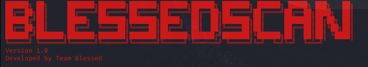

<p align="center">
    
  </p>
  
  
  
  # BlessedScan: A New Tool for Network Scanning and Cybersecurity
  
  We at Team Blessed are proud to announce the release of our new tool, BlessedScan. This tool is designed to facilitate scanning and analysis tasks in the field of cybersecurity, aiding both professionals and enthusiasts in conducting comprehensive and quick scans of networks and domains.
  ## 🚀 Quickstart
  
  ### Installation
  
  ```bash
  * `git clone https://github.com/blessed-cyber/BlessedScan.git`
  * `cd BlessedScan`
  * `python3 BlessedScan.py`
  ```
  
  
  ## 🔑 Core Features
  
  - **URL to IP Conversion**: This feature helps convert URLs to IP addresses, allowing for more precise identification of websites and servers.
  - **Fast Scan**: This functionality enables users to perform quick scans of specified addresses, providing immediate results on open ports and available services.
  - **Deep Scan**: The deep scan offers a thorough and detailed analysis of ports and services, helping to identify vulnerabilities and potential weak points.
  - **WHOIS Lookup**: This feature allows users to retrieve registration and ownership information for domains, providing clear insights into the identity and responsibility of websites.
  
